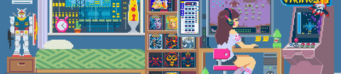

  
<h1>🌳Pixel Arts🌳</h1>

<h2>🌐About🌐</h2>
Repository is for all my pixel arts. All arts is free to use.

<h2>✨Contributors✨</h2>
<table align=center>
    <td align=center>
    
    <a href="https://github.com/Kokomichrzan">
Kokomichrzan
</a>
    <table align=center>
      <td title="Arts">🌳</td>
      <td title="Manage">💼</td>
    </table>
  </td>
</table>

